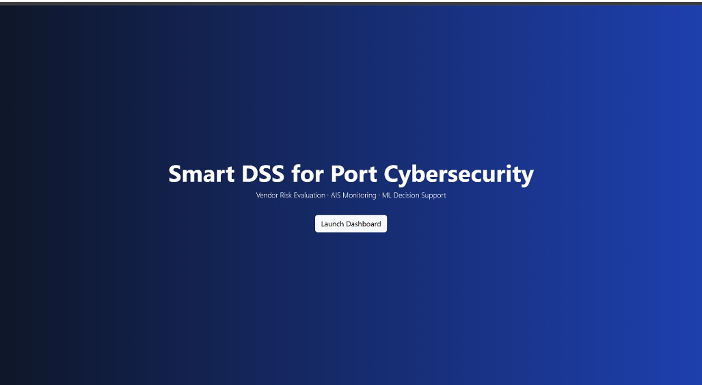
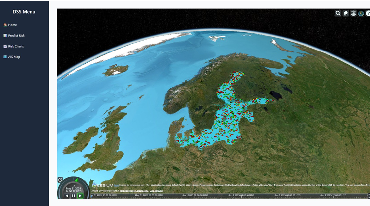
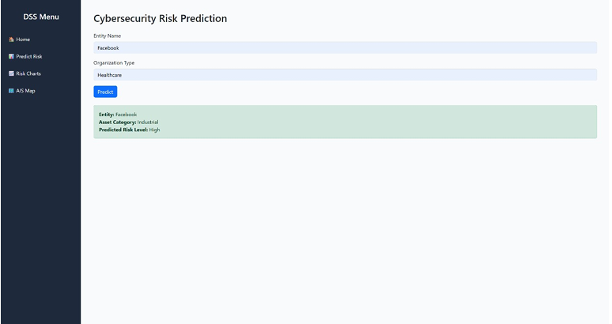

# Smart DSS for Port Cybersecurity

A **decision-support system (DSS)** that helps port authorities and maritime operators assess vendor/organization cyber risk, visualize AIS vessel activity, and generate quick ML-driven risk predictions.

> **Modules**
> - **Home** – overview + one-click dashboard launch  
> - **Predict Risk** – form to predict risk level for an entity  
> - **Risk Charts** – top entities and organization-type breakdown  
> - **AIS Map** – globe view to explore vessel density/events

---

## 📸 Screenshots

> Make sure these images exist in an `images/` folder (or update the paths).

**Landing**  


**Risk Insights Dashboard**  


**AIS 3D Globe**  


**Risk Prediction**  


---

## ✨ Features

- **ML Risk Prediction** – outputs *High / Medium / Low* for a given entity using a trained model (+ preprocessing pipeline).
- **Exploratory Analytics** – “Top N entities by risk”, organization-type breakdown, quick comparisons.
- **AIS Map Integration** – interactive 3D/2D map (Cesium/Deck/Leaflet depending on build) for maritime situational awareness.
- **Simple UX** – clean left-hand menu; runs in any modern browser.
- **Portable** – start locally with Python or run as a container.

---

## 🧱 Tech Stack

- **UI/Dashboard:** Streamlit (or Dash)
- **ML:** scikit-learn / XGBoost (saved `model.pkl`)
- **Geospatial:** Cesium/Deck/Leaflet tiles via web components
- **Data:** CSV/Parquet samples for risk entities and AIS points

> If your implementation differs, update the names/paths accordingly.

---

## 🚀 Quickstart

### 1) Requirements
- Python **3.10+**
- `pip` (or `uv`/`pipx`)
- Optional: Node.js if rebuilding custom map widgets

### 2) Setup
```bash
python -m venv .venv
# Windows: .venv\Scripts\activate
source .venv/bin/activate
pip install -r requirements.txt
````

### 3) Run

```bash
streamlit run app.py
# App opens at http://localhost:8501
```

---

## 📂 Suggested Project Structure

```
SDSS-Port-Management/
├── app.py                     # Streamlit entry
├── dss/
│   ├── pages/
│   │   ├── 01_🏠_Home.py
│   │   ├── 02_🧠_Predict_Risk.py
│   │   ├── 03_📊_Risk_Charts.py
│   │   └── 04_🗺️_AIS_Map.py
│   ├── ml/
│   │   ├── model.pkl          # Trained model
│   │   └── preprocessing.pkl  # Optional scaler/encoder pipeline
│   ├── data/
│   │   ├── risk_entities.csv
│   │   └── ais_sample.parquet
│   └── utils.py
├── images/
│   ├── landing-164727.png
│   ├── risk-insights-164744.png
│   ├── ais-map-164757.png
│   └── predictor-164813.png
├── requirements.txt
└── README.md
```

---

## ⚙️ Configuration

Create a `.env` or set environment variables:

```
APP_NAME="Smart DSS for Port Cybersecurity"
DEFAULT_TOP_N=10

# Optional map tokens/URLs
CESIUM_ION_TOKEN=
MAP_TILES_URL=
```

The app loads these via `python-dotenv` or `os.environ`.

---

## 🧠 Model Notes

* Supervised classifier trained on labeled vendor/org risk data (industry, exposure, past incidents, size, etc. as features).
* Artifacts:

  * `dss/ml/model.pkl` – estimator
  * `dss/ml/preprocessing.pkl` – encoder/scaler pipeline (optional)
* Output classes: `High`, `Medium`, `Low`. Thresholds are configurable.

**Retraining (example):**

```bash
python -m dss.ml.train \
  --input dss/data/risk_entities.csv \
  --model-out dss/ml/model.pkl \
  --prep-out dss/ml/preprocessing.pkl
```

---

## 🗺️ AIS Map

* Renders AIS points/heat or tracks from `ais_sample.parquet` (or an API source).
* Switch base layers/tiles with env vars above.
* If Cesium/3D isn’t available, fall back to 2D tiles.

---

## 🧪 Testing

```bash
pytest -q
```

Recommended tests:

* Preprocessing/feature engineering
* Model load & predict
* Page rendering smoke tests (e.g., streamlit testing utilities or playwright)

---

## 🐳 Docker (Optional)

```bash
# Build
docker build -t sdss-ports:latest .

# Run
docker run --rm -p 8501:8501 \
  -e APP_NAME="Smart DSS for Port Cybersecurity" \
  sdss-ports:latest
```

---

## 🔐 Security & Data

* Use demo/sample data unless you have rights to real vendor/port data.
* Keep secrets out of VCS; prefer `.env` locally and a secret manager in prod.
* For production, add authentication (e.g., OAuth2 reverse proxy) and HTTPS.

---

## 🗺️ Roadmap

* Role-based access control & audit logs
* Live AIS feed + anomaly scoring
* Vendor knowledge graph / supply-chain relationships
* Model monitoring (drift/quality) & scheduled retraining

---

## 📄 License

MIT (or your preferred license). See `LICENSE`.

---

## 🙌 Acknowledgements

* Streamlit, scikit-learn/XGBoost, Cesium/Deck/Leaflet
* Public maritime & cyber datasets used to bootstrap demos
```
